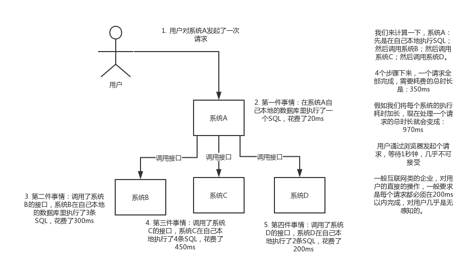
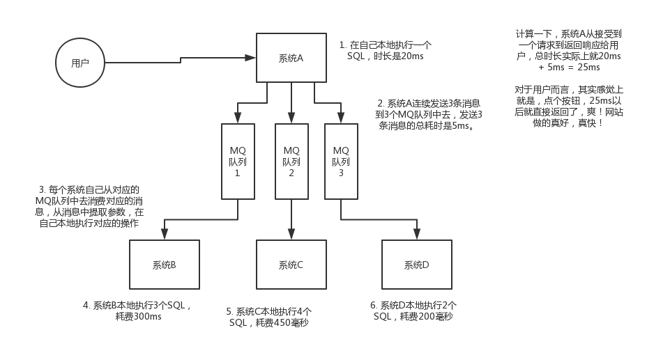
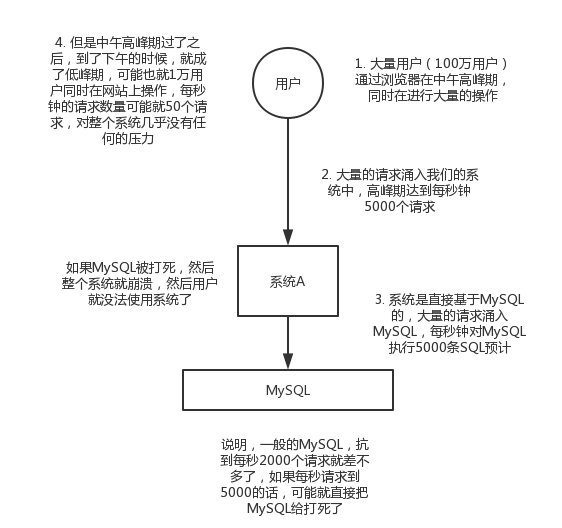

# 突击训练课程学习笔记

因为java面试题是一个较为大的体系，所以我们会拆分为几季来讲解，预计是会推出3季，本次是第一季，第一季课程包含的内容如下：

## 1、分布式系统

1.1 为什么要进行系统拆分？

（1）为什么要进行系统拆分？如何进行系统拆分？拆分后不用dubbo可以吗？dubbo和thrift有什么区别呢？

1.2 分布式服务框架

（1）说一下的dubbo的工作原理？注册中心挂了可以继续通信吗？

（2）dubbo支持哪些序列化协议？说一下hessian的数据结构？PB知道吗？为什么PB的效率是最高的？

（3）dubbo负载均衡策略和高可用策略都有哪些？动态代理策略呢？

（4）dubbo的spi思想是什么？

（5）如何基于dubbo进行服务治理、服务降级、失败重试以及超时重试？

（6）分布式服务接口的幂等性如何设计（比如不能重复扣款）？

（7）分布式服务接口请求的顺序性如何保证？

（8）如何自己设计一个类似dubbo的rpc框架？

1.3 分布式锁

（1）使用redis如何设计分布式锁？使用zk来设计分布式锁可以吗？这两种分布式锁的实现方式哪种效率比较高？

1.4 分布式事务

（1）分布式事务了解吗？你们如何解决分布式事务问题的？TCC如果出现网络连不通怎么办？XA的一致性如何保证？

1.5 分布式会话

（1）集群部署时的分布式session如何实现？

## 2、高并发架构

2.1 如何设计一个高并发系统？

2.2 消息队列

（1）为什么使用消息队列啊？消息队列有什么优点和缺点啊？kafka、activemq、rabbitmq、rocketmq都有什么优点和缺点啊？

（2）如何保证消息队列的高可用啊？

（3）如何保证消息不被重复消费啊（如何进行消息队列的幂等性问题）？

（4）如何保证消息的可靠性传输（如何处理消息丢失的问题）？

（5）如何保证消息的顺序性？

（6）如何解决消息队列的延时以及过期失效问题？消息队列满了以后该怎么处理？有几百万消息持续积压几小时，说说怎么解决？

（7）如果让你写一个消息队列，该如何进行架构设计啊？说一下你的思路

2.3 搜索引擎

（1）es的分布式架构原理能说一下么（es是如何实现分布式的啊）？

（2）es写入数据的工作原理是什么啊？es查询数据的工作原理是什么啊？底层的lucene介绍一下呗？倒排索引了解吗？

（3）es在数据量很大的情况下（数十亿级别）如何提高查询效率啊？

（4）es生产集群的部署架构是什么？每个索引的数据量大概有多少？每个索引大概有多少个分片？

2.4 缓存

（1）在项目中缓存是如何使用的？缓存如果使用不当会造成什么后果？

（2）redis和memcached有什么区别？redis的线程模型是什么？为什么单线程的redis比多线程的memcached效率要高得多？

（3）redis都有哪些数据类型？分别在哪些场景下使用比较合适？

（5）redis的过期策略都有哪些？手写一下LRU代码实现？

（6）如何保证Redis高并发、高可用、持久化？redis的主从复制原理能介绍一下么？redis的哨兵原理能介绍一下么？

（7）redis的持久化有哪几种方式？不同的持久化机制都有什么优缺点？持久化机制具体底层是如何实现的？

（8）redis集群模式的工作原理能说一下么？在集群模式下，redis的key是如何寻址的？分布式寻址都有哪些算法？了解一致性hash算法吗？如何动态增加和删除一个节点？

（9）了解什么是redis的雪崩和穿透？redis崩溃之后会怎么样？系统该如何应对这种情况？如何处理redis的穿透？

（10）如何保证缓存与数据库的双写一致性？

（11）redis的并发竞争问题是什么？如何解决这个问题？了解Redis事务的CAS方案吗？

（12）生产环境中的redis是怎么部署的？

2.5 分库分表

（2）为什么要分库分表（设计高并发系统的时候，数据库层面该如何设计）？用过哪些分库分表中间件？不同的分库分表中间件都有什么优点和缺点？你们具体是如何对数据库如何进行垂直拆分或水平拆分的？

（3）现在有一个未分库分表的系统，未来要分库分表，如何设计才可以让系统从未分库分表动态切换到分库分表上？

（4）如何设计可以动态扩容缩容的分库分表方案？

（5）分库分表之后，id主键如何处理？

2.6 读写分离

（1）如何实现mysql的读写分离？MySQL主从复制原理的是啥？如何解决mysql主从同步的延时问题？

## 3、高可用架构

3.1 如何设计一个高可用系统？

3.2 限流

（1）如何限流？在工作中是怎么做的？说一下具体的实现？

3.3 熔断

（1）如何进行熔断？熔断框架都有哪些？具体实现原理知道吗？

3.4 降级

（1）如何进行降级？

# 视频课程内容
备注：前一、二、三、四讲无用

## 4、MQ

1、为什么用MQ，不用可以吗？

2、消息队列的优缺点？

3、kafka、activemq、rabbitmq、rocketmq都有什么区别？

4、如何保证消息队列的高可用啊？

5、如何保证消息不被重复消费啊？如何保证消费的时候是幂等的啊？

6、如何保证消息的可靠性传输啊？要是消息丢失了怎么办啊？

7、那如何保证消息的顺序性？

8、如何解决消息队列的延时以及过期失效问题？消息队列满了以后该怎么处理？有几百万消息持续积压几小时，说说怎么解决？

9、如果让你写一个消息队列，该如何进行架构设计啊？说一下你的思路

## 05_如何进行消息队列的技术选型？

先说一下消息队列的常见使用场景吧，其实场景有很多，但是比较核心的有3个：解耦、异步、削峰

解耦：现场画个图来说明一下，A系统发送个数据到BCD三个系统，接口调用发送，那如果E系统也要这个数据呢？
那如果C系统现在不需要了呢？现在A系统又要发送第二种数据了呢？A系统负责人濒临崩溃中。。。再来点更加崩溃的事儿，
A系统要时时刻刻考虑BCDE四个系统如果挂了咋办？我要不要重发？我要不要把消息存起来？头发都白了啊。。。

[解耦降低系统之间的依赖] [A需要考虑依赖模块是否超时、依赖挂了、是否需要重发]

- 
- 

面试技巧：你需要去考虑一下你负责的系统中是否有类似的场景，就是一个系统或者一个模块，调用了多个系统或者模块，互相之间的调用很复杂，
维护起来很麻烦。但是其实这个调用是不需要直接同步调用接口的，如果用MQ给他异步化解耦，也是可以的，你就需要去考虑在你的项目里，
是不是可以运用这个MQ去进行系统的解耦。在简历中体现出来这块东西，用MQ作解耦。

异步：现场画个图来说明一下，A系统接收一个请求，需要在自己本地写库，还需要在BCD三个系统写库，自己本地写库要3ms，
BCD三个系统分别写库要300ms、450ms、200ms。最终请求总延时是3 + 300 + 450 + 200 = 953ms，接近1s，用户感觉搞个什么东西，慢死了慢死了。

[异步降低请求链的处理时长]

备注：图片中的350ms不准确可以忽略，看下面的970ms为准

- 
- 

削峰：每天0点到11点，A系统风平浪静，每秒并发请求数量就100个。结果每次一到11点~1点，每秒并发请求数量突然会暴增到1万条。
但是系统最大的处理能力就只能是每秒钟处理1000个请求啊。。。尴尬了，系统会死。。。

- 
- 

## 06_引入消息队列之后该如何保证其高可用性？

## 07_我的天！我为什么在消息队列里消费到了重复的数据？

## 08_啥？我发到消息队列里面的数据怎么不见了？

## 09_我该怎么保证从消息队列里拿到的数据按顺序执行？

## 10_完了！生产事故！几百万消息在消息队列里积压了几个小时！

## 11_如果让你来开发一个消息队列中间件，你会怎么设计架构？

## 12_总结一下消息队列相关问题的面试技巧

## 13_体验一下面试官对于分布式搜索引擎的4个连环炮

## 14_分布式搜索引擎的架构是怎么设计的？为啥是分布式的？

## 15_分布式搜索引擎写入和查询的工作流程是什么样的？

## 16_分布式搜索引擎在几十亿数据量级的场景下如何优化查询性能？

## 17_你们公司生产环境的分布式搜索引擎是怎么部署的呢？

## 18_总结一下分布式搜索引擎相关问题的面试技巧

## 19_先平易近人的随口问你一句分布式缓存的第一个问题

## 20_来聊聊redis的线程模型吧？为啥单线程还能有很高的效率？

##

